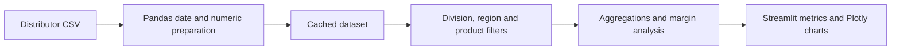
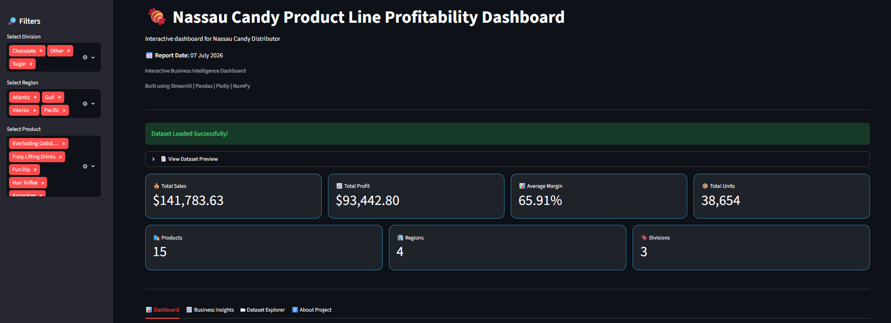
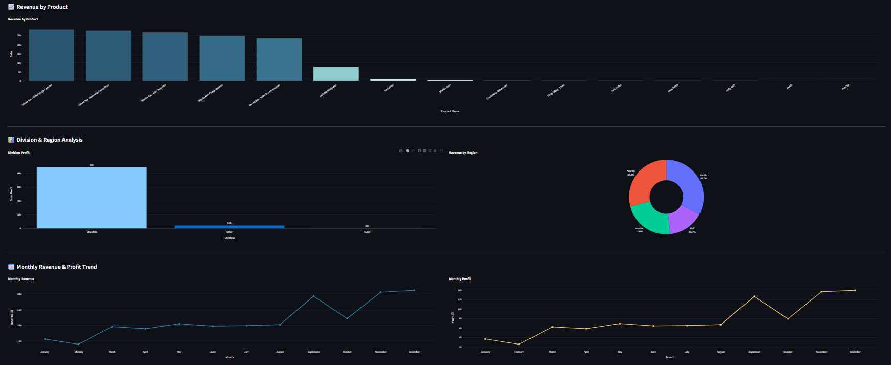
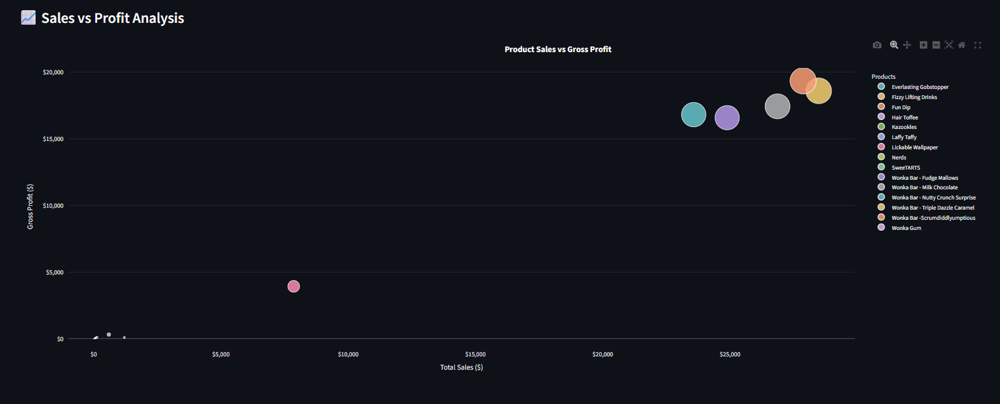
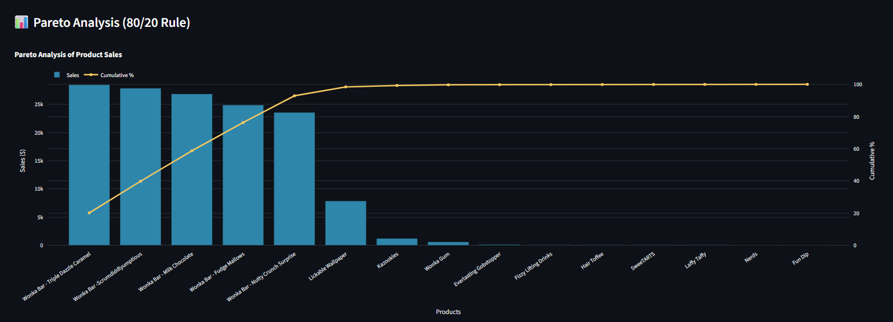
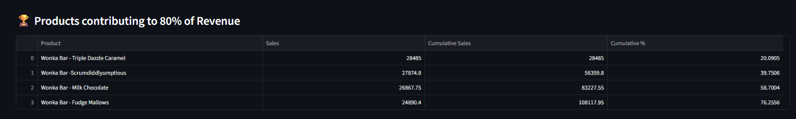
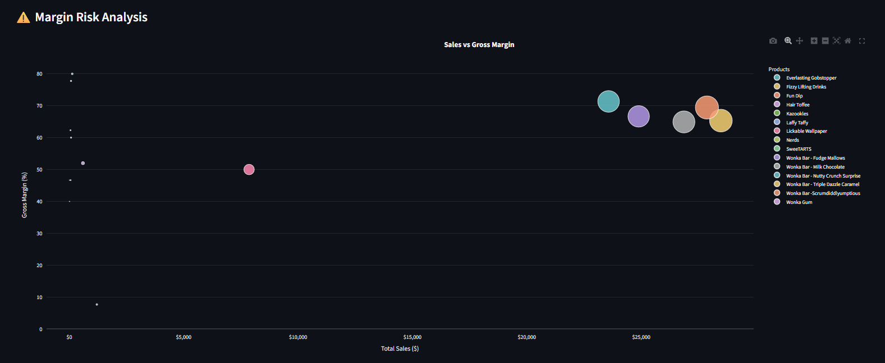
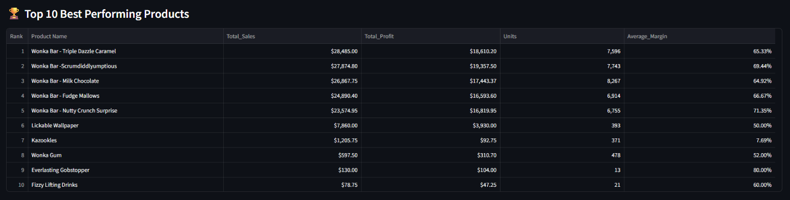
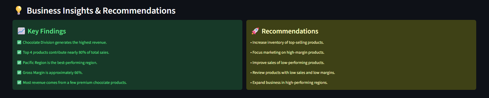
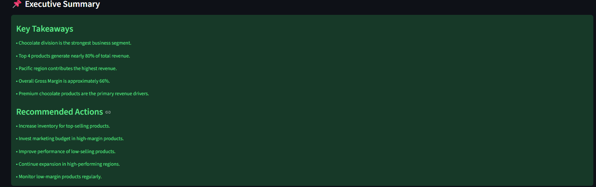

# Nassau Candy — Product-Line Profitability Dashboard

An interactive analytics dashboard by **Pathlavath Shiva Kumar** for exploring product sales, gross profit, margins and regional performance in the Nassau Candy Distributor dataset.

## Problem and approach

Revenue alone does not show which products contribute profit. This project prepares order-level CSV data and combines filters, visual comparisons and detail tables in a Streamlit application.

## Features

- Division, region and product filters.
- Sales, gross-profit, margin and unit summaries.
- Product and regional comparisons, plus monthly sales/profit trends.
- Sales-versus-profit plots, cumulative revenue contribution and Pareto analysis.
- Margin-risk exploration, top-product tables and a dataset preview.

**Stack:** Python, Pandas, Streamlit and Plotly. The dashboard's implemented analysis is descriptive; forecasting and prediction are future work.

## Architecture



## Structure

```text
app.py                           Dashboard and data preparation
analysis.ipynb                   Exploratory notebook
data/Nassau Candy Distributor.csv Input dataset
images/                          Existing dashboard screenshots
requirements.txt                 Python dependencies
LICENSE                          Repository license
```

## Run locally

```bash
git clone https://github.com/shivakumar9121/Nassau-Candy-Product-Line-Profitability-Dashboard.git
cd Nassau-Candy-Product-Line-Profitability-Dashboard
python -m venv .venv
# Windows: .venv\Scripts\activate
# macOS/Linux: source .venv/bin/activate
pip install -r requirements.txt
streamlit run app.py
```

Run from the repository root so the CSV path resolves. Open the local URL printed by Streamlit.

## Dashboard previews











## Outputs and limits

The result is an interactive dataset-exploration tool. Findings vary with the data and selected filters. Dashboard recommendations should be checked against business context; no verified cost saving, revenue increase or client adoption is claimed.

Potential improvements include automated aggregation checks, clearer separation of data preparation from presentation, and validation of every narrative summary against the active filters.

## Author

Pathlavath Shiva Kumar · B.Tech CSE, IIIT Vadodara · Class of 2027

[GitHub](https://github.com/shivakumar9121) · [LinkedIn](https://www.linkedin.com/in/pathlavath-shiva-kumar-441517321/)

